# Laporan Proyek Machine Learning - Rifqi Arrahim
 
## Project Overview
Anime merupakan salah satu hiburan yang banyak digemari orang orang. Menurut dokumen tahun 2004 dari Japan External Trade Organization dari artikel [12 SHOCKING FACTS ABOUT ANIME YOU NEED TO KNOW](https://newslanded.com/2020/07/03/12-shocking-facts-about-anime-you-need-to-know/), film anime dan acara televisi menyumbang 60% dari hiburan berbasis animasi dunia. Hampir 40 sekolah di Jepang telah mendeklarasikan anime sebagai mata pelajaran tersendiri. Akting suara anime juga sangat besar, karena Jepang memiliki sekitar 130 sekolah akting suara.
## Business Understanding
Setiap Anime memiliki genre, tipe dan jumlah episode yang berbeda-beda. Berikut adalah tipe-tipe anime:
1. Movie
2. TV
3. OVA(Original Video Animation)
4. Music
5. ONA(Original Net Anime)
6. Special
 
### Problem Statements
- Bagaimana membuat sistem rekomendasi anime berdasarkan tipe anime?
- Dengan data rating yang ada, bagaimana memberikan rekomendasi anime yang mungkin akan disukai penonton?
### Goals
- Membuat sistem rekomendasi anime berdasarkan tipe anime.
- Memberikan rekomendasi anime yang mungkin akan disukai penonton berdasarkan rating yang diberikan.
 
### Solution Approach
- Membuat sistem rekomendasi yang telah dipersonalisasi menggunakan teknik content based filtering
- Memberikan sejumlah rekomendasi animme yang sesuai dengan preferensi penonton dengan teknik collaborative filtering
 
## Data Understanding
Data Understanding adalah tahap awal proyek untuk memahami data yang dimiliki. Tahap Data Understanding penting untuk memahami variabel-variabel pada data serta korelasi antar variabel. Dalam kasus ini, kita memiliki 2 [file](https://www.kaggle.com/CooperUnion/anime-recommendations-database) terpisah mengenain anime dan rating. Pada file anime terdapat 12294 record dan 6 fitur yaitu anime_id, name, genre, type, episodes, rating, dan members. Pada file rating terdapat 7813737 record dan 3 fitur yaitu user_id, anime_id, dan rating.
### Anime.csv
1. anime_id - id unik myanimelist.net untuk mengidentifikasi anime.
2. name - nama lengkap anime.
3. genre - gnere anime.
4.type - tipe anime seperti : movie, TV, OVA, Special, Music, ONA.
5. episodes - jumlah episode. 1 untuk movie.
6. rating - rata-rata rating.
7. members - jumlah member grup anime.
### Rating.csv
1. user_id - id user yang acak.
2. anime_id - id anime.
3. rating - rating yang diberikan.
 

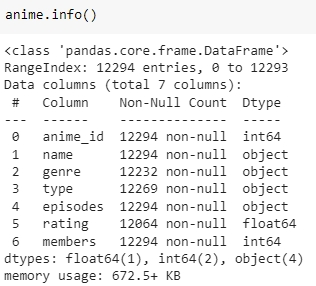 
Berdasarkan output diatas, kita dapat mengetahui anime.csv memiliki 12294 entri
 
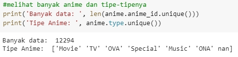 
Terdapat 12294 data anime yang unik dengan 6 jenis tipe anime. 
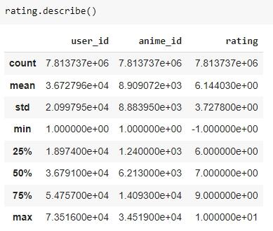 
Dari output diatas, diketahui bahwa nilai maksimum rating adalah 10 dan nilai minimum -1. 
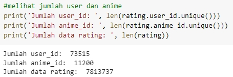 
Berdasarkan output diatas, kita dapa mengetahui jumlah user yang memberikan rating, jumlah anime, dan jumlah data rating.

 
 
## Data preparation
### Missing Value
Saya mengecek nilai 0 pada file anime dan rating. Ketika ada data yang bernilai 0, Saya akan menghapus record tersebut. Hal ini perlu dilakukan untuk menghindari membuat model machine learning yang bias.
### Feature Engineering
Feature Engineering merupakan proses membuat variabel input baru dari variabel data yang sudah ada. 
- Penulis melakukan konversi data series anime_id, name, type menjadi list. Dalam hal ini, kita menggunakan fungsi tolist() dari library numpy. Untuk nantinya diubah ke dictionary.
- Pada data rating terdapat nilai -1 yang menandakan user belum memberi rating. Penulis mengubah -1 menjadi 0 karena akan mempengaruhi model.
- Penulis melakukan encode fitur ‘user_id’ dan ‘anime_id’ ke dalam indeks integer dan mengubah tipe data fitur rating menjadi float. Tahap ini dilakukan agar data siap digunakan untuk pemodelan.
- Rating memiliki data berjumlah 7813737. Penulis memutuskan mengambil sample sebanyak 73515 sesuai dengan jumlah user. Hal ini dilakukan karena keterbatasan runtime pada Google Colab. Untuk mengolah data sebanyak itu penulis perlu menggunakan Google Colab Pro
### Normalisasi
- Membuat rating dalam skala 0 sampai 1 agar mudah dalam melakukan proses training. 
### Data Transform
- Penulis membagi data rating menjadi data latih sebanyak 80% dan data validasi sebanyak 20%.
## Modelling
### Content Based Filtering
Ide dari sistem rekomendasi berbasis konten (content-based filtering) adalah merekomendasikan item yang mirip dengan item yang disukai pengguna di masa lalu. Penulis membangun sistem rekomendasi sederhana berdasarkan tipe anime. Misal, jika Anda menyukai anime A bertipe C, sistem akan merekomendasikan anime B yang bertipe C juga. Content-based filtering mempelajari profil minat pengguna baru berdasarkan data dari objek yang telah dinilai pengguna. Content based filtering membutuhkan deskripsi item/fitur yang baik. Algoritma ini bekerja dengan menyarankan item serupa yang pernah disukai di masa lalu atau sedang dilihat di masa kini kepada pengguna. Semakin banyak informasi yang diberikan pengguna, semakin baik akurasi sistem rekomendasi. Untuk membuat profil pengguna, terdapat dua informasi penting bagi sistem dengan pendekatan content-based filtering: 
- Model preferensi pengguna.
- Riwayat interaksi pengguna dengan sistem rekomendasi.
#### TF-IDF Vectorizer
Teknik TF-IDF Vectorizer akan digunakan pada sistem rekomendasi untuk menemukan representasi fitur penting dari setiap tipe anime. Penulis menggunakan fungsi tfidfvectorizer() dari library sklearn. 
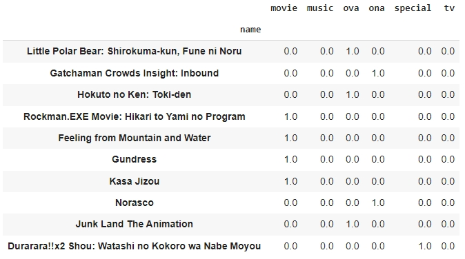 
Berikut vektor tf-idf dalam bentuk matriks. Output matriks tf-idf di atas menunjukkan Little Polar Bear: Shirokuma-kun, Fune ni Noru memiliki kategori OVA. Hal ini terlihat dari nilai matriks 1.0 pada kategori OVA.
#### Cosine Similarity
Pada tahap sebelumnya, penulis telah berhasil mengidentifikasi korelasi antara anime dengan tipenya. Sekarang, penulis akan menghitung derajat kesamaan (similarity degree) antar anime dengan teknik cosine similarity. Di sini, penulis menggunakan fungsi cosine_similarity dari library sklearn.  
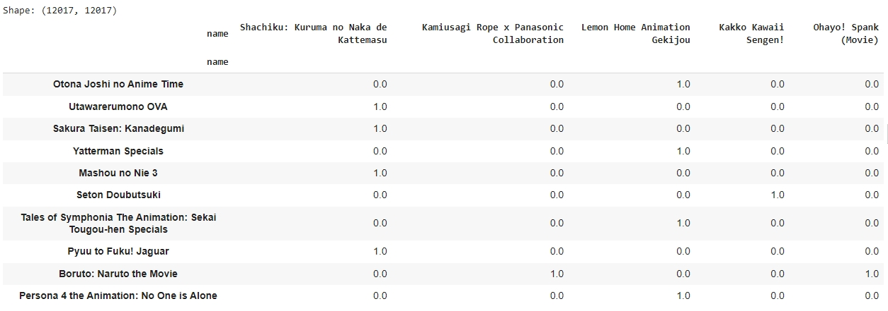 
Dengan cosine similarity, kita berhasil mengidentifikasi kesamaan antara satu anime dengan anime lainnya. Shape (12017, 12017) merupakan ukuran matriks similarity dari data yang kita miliki. Berdasarkan data yang ada, matriks di atas sebenarnya berukuran 12017 anime x 12017 anime (masing-masing dalam sumbu X dan Y). Angka 1.0 mengindikasikan bahwa anime pada kolom X (horizontal) memiliki kesamaan dengan anime pada baris Y (vertikal). Sebagai contoh, anime Otona Joshi no Anime Time teridentifikasi sama (similar) dengan Lemon Home Animation Gekijou.
#### Mendapatkan Rekomendasi
Sebelumnya, kita telah memiliki data similarity (kesamaan) antar anime. Kini, tibalah saatnya  menghasilkan sejumlah anime yang akan direkomendasikan kepada pengguna. Pengguna X pernah menonton anime Otona Joshi no Anime Time. Kemudian, saat pengguna tersebut berencana untuk menonton anime lain, sistem akan merekomendasikan Lemon Home Animation Gekijou. Nah, rekomendasi anime ini berdasarkan kesamaan yang dihitung dengan cosine similarity pada tahap sebelumnya. Penulis membuat fungsi anime_recommendations dengan beberapa parameter sebagai berikut:
- nama_anime : Nama anime (index kemiripan dataframe).
- Similarity_data : Dataframe mengenai similarity yang telah kita definisikan sebelumnya.
- Items : Nama dan fitur yang digunakan untuk mendefinisikan kemiripan, dalam hal ini adalah ‘name’ dan ‘type’.
- k : Banyak rekomendasi yang ingin diberikan.
#### Result
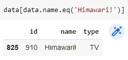 
Himawari termasuk dalam kategori TV. Tentu kita berharap rekomendasi yang diberikan adalah anime dengan tipe yang mirip. Nah, sekarang, dapatkan anime recommendation dengan memanggil fungsi anime_recommendation. 
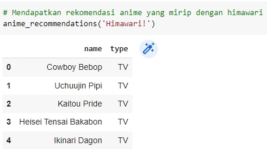 
Sistem kita memberikan rekomendasi 5 nama anime dengan tipe TV.
### Collaborative Filtering
Collaborative filtering bergantung pada pendapat komunitas pengguna. Ia tidak memerlukan atribut untuk setiap itemnya seperti pada sistem berbasis konten. Collaborative Filtering membutuhkan banyak feedback dari pengguna agar sistem berfungsi dengan baik.
#### Proses Training
Model akan menghitung skor kecocokan antara pengguna dan anime dengan teknik embedding. Pertama, kita melakukan proses embedding terhadap data user dan anime. Selanjutnya, lakukan operasi perkalian dot product antara embedding user dan anime. Selain itu, kita juga dapat menambahkan bias untuk setiap user dan anime. Skor kecocokan ditetapkan dalam skala [0,1] dengan fungsi aktivasi sigmoid. Penulis membuat class RecommenderNet dengan keras Model class. Kode class RecommenderNet ini terinspirasi dari tutorial dalam situs Keras. Model ini menggunakan Binary Crossentropy untuk menghitung loss function, Adam (Adaptive Moment Estimation) sebagai optimizer, dan root mean squared error (RMSE) sebagai metrics evaluation. 
#### Result
Untuk mendapatkan rekomendasi anime, pertama kita ambil sampel user secara acak dan definisikan variabel anime_not_watched yang merupakan daftar anime yang belum pernah ditonton oleh pengguna. Hal ini karena daftar anime_not_watched inilah yang akan menjadi anime yang kita rekomendasikan. Variabel anime_not_watched diperoleh dengan menggunakan operator bitwise (~) pada variabel anime_watched_by_user. 
 
hasil di atas adalah rekomendasi untuk user dengan id 43652. Dari output tersebut, kita dapat membandingkan antara anime with high ratings from user dan Top 10 anime recommendation untuk user. Perhatikanlah, beberapa anime bertipe sesuai dengan rating user. Kita memperoleh 4 anime bertipe TV, 3 anime bertipe Movie, dan 3 anime bertipe OVA.

## Evaluation
### Content Based Filtering
Merupakan rasio prediksi benar positif dibandingkan dengan keseluruhan hasil yang diprediksi positf.  
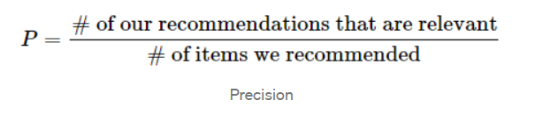 
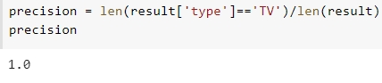 
Sistem Rekomendasi memiliki nilai precision 1.0. Berarti model yang dibangun dapat memberikan rekomendasi yang tepat.
### Collaborative Filtering
Pengertian Root Mean Square Error (RMSE) adalah  metode pengukuran dengan mengukur perbedaan nilai dari prediksi sebuah model sebagai estimasi atas nilai yang diobservasi. Root Mean Square Error adalah hasil dari akar kuadrat Mean Square Error. Keakuratan metode estimasi kesalahan pengukuran ditandai dengan adanya nilai RMSE yang kecil. Metode estimasi yang mempunyai Root Mean Square Error (RMSE) lebih kecil dikatakan lebih akurat daripada metode estimasi yang mempunyai Root Mean Square Error (RMSE) lebih besar. 
 
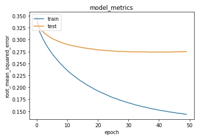 
Proses training model cukup smooth dan model konvergen pada epochs sekitar 50. Dari proses ini, kita memperoleh nilai error akhir sebesar sekitar 0.14 dan error pada data validasi sebesar 0.28. Nilai tersebut cukup bagus untuk sistem rekomendasi.
 
